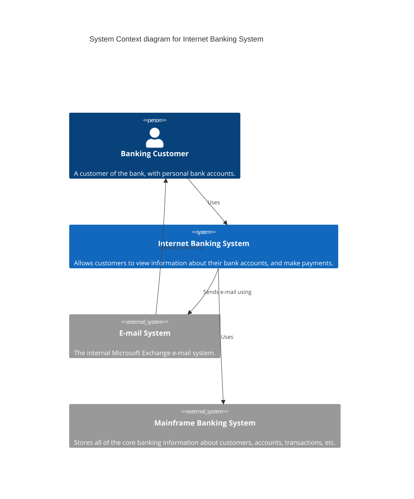

```mermaid
C4Context
    title System Context diagram for Internet Banking System

    Person(customer, "Banking Customer", "A customer of the bank, with personal bank accounts.")
    System(bankingSystem, "Internet Banking System", "Allows customers to view information about their bank accounts, and make payments.")
    System_Ext(mailSystem, "E-mail System", "The internal Microsoft Exchange e-mail system.")
    System_Ext(mainframe, "Mainframe Banking System", "Stores all of the core banking information about customers, accounts, transactions, etc.")

    Rel(customer, bankingSystem, "Uses")
    Rel_Back(customer, mailSystem, "Sends e-mails to")
    Rel(bankingSystem, mailSystem, "Sends e-mail using")
    Rel(bankingSystem, mainframe, "Uses")
```
